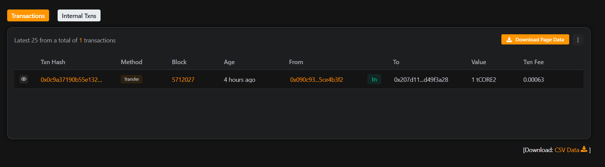

# LootLegends-blockchain
# LootLegends

**NFT-driven dungeon crawler where loot drops are minted as tradable NFTs**

---

## 🧙 Project Description

**LootLegends** is a revolutionary blockchain-based dungeon crawler that transforms traditional loot mechanics into a decentralized NFT economy. Players explore dangerous dungeons, battling monsters and discovering rare loot—each item is minted as a unique, tradable NFT on the Ethereum blockchain.

Each loot drop has distinct attributes such as:
- **Rarity**
- **Item Type**
- **Combat Stats** (Power, Defense, Magic)

The game features a dynamic rarity system where higher-level dungeons offer greater chances of acquiring legendary items. Players can trade items through the built-in marketplace or combine multiple NFTs to forge upgraded loot.

---

## 🚀 Project Vision

We aim to create the **first truly decentralized RPG economy**, enabling full ownership of in-game assets. LootLegends bridges traditional gaming with Web3 by ensuring players can monetize their gameplay through NFT ownership and trading.

In the long term, we envision a **metaverse-ready** platform where LootLegends items can be used across multiple virtual worlds and games.

---

## 🔑 Key Features

### 🎮 Core Gameplay
- **Dungeon Crawling**: Explore 10 difficulty levels
- **Dynamic Loot**: Pseudo-randomized generation with rarity and stats
- **Cooldown System**: 1-hour strategic cooldown between runs
- **Progressive Difficulty**: Higher levels = better loot, higher cost

### 🎯 NFT & Trading
- **Loot NFTs**: ERC-721 tokens for every loot drop
- **Marketplace**: Peer-to-peer trading built-in
- **Upgrading**: Merge 2-5 items to forge better loot
- **Rarity Tiers**: Common, Uncommon, Rare, Epic, Legendary

### 🛡️ Security & Economics
- **Platform Fee**: 10% trading fee sustains the economy
- **Smart Contract Security**: Reentrancy protection, pausable logic
- **Scarcity**: Max cap of 10,000 loot NFTs

### 📊 Player Progression
- **Stats Tracking**: Total crawls, loot, and last active
- **Rarity Collection**: View your loot by rarity tiers
- **Achievements**: Earn accomplishments through gameplay

---

## 📅 Future Scope

### 🚀 Short-Term (3–6 months)
- Native iOS/Android app
- Web3 UI/UX with MetaMask
- Guild System for co-op gameplay
- Leaderboards & seasonal tournaments

### 🌟 Medium-Term (6–12 months)
- Multi-chain support (Polygon, Arbitrum, etc.)
- PvP combat with owned loot
- Land NFTs for dungeon ownership
- NFT staking rewards

### 🔮 Long-Term Vision (1–2 years)
- NFT interoperability across games
- VR dungeon crawling
- AI-generated content (loot + dungeons)
- DAO governance
- Loot breeding system

### 🌐 Metaverse Integration
- Use/display loot in virtual spaces
- Virtual showrooms & community events
- Unified profiles across Web3 games
- Blockchain gaming education workshops

---

## 🛠️ Installation & Setup

### 1. Clone the repository

## Contract address - 0x207d11Fd8d019C6C4655613F36dF6752d49F3A28

## Transaction Image

